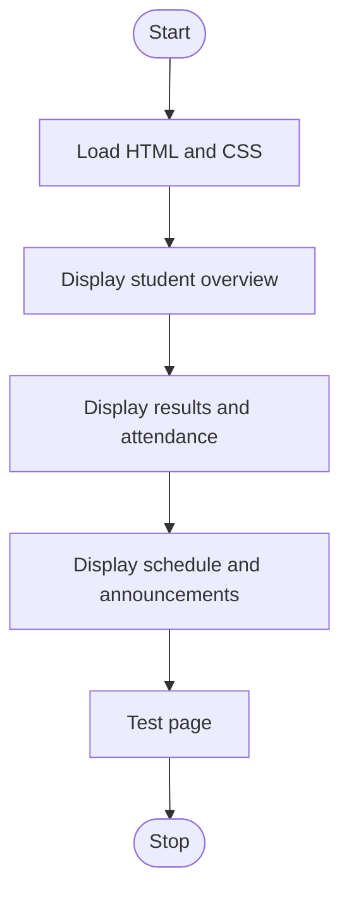

# Student Dashboard Flowchart

```mermaid
flowchart TD
A([Start]) --> B[Load HTML and CSS]
B --> C[Display student overview]
C --> D[Display results and attendance]
D --> E[Display schedule and announcements]
E --> F[Test page]
F --> G([Stop])
```
